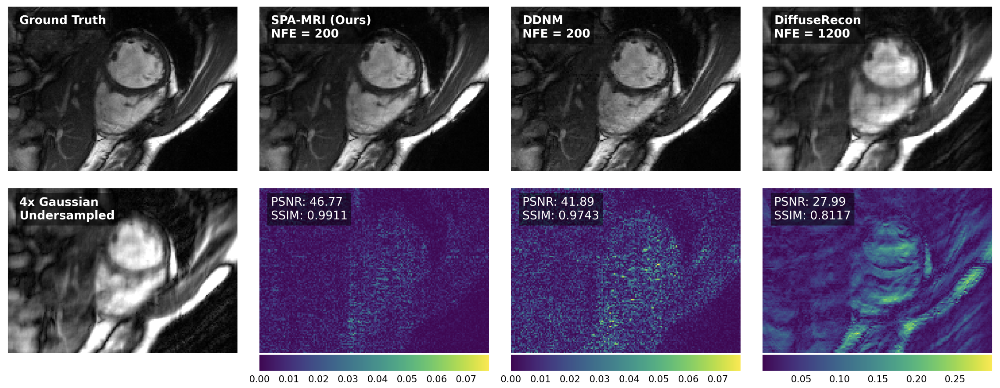

# Sampling-Pattern-Agnostic MRI Reconstruction through Adaptive Consistency Enforcement with Diffusion Model



## About
This repository contains the official implementation for "Sampling Pattern Agnostic MRI Reconstruction through Adaptive Consistency Enforcement with Diffusion Model" from [CRXRECON Challenge 2024](https://cmrxrecon.github.io/2024/Home.html).

## Implementational Details
This code extends the [Diffusion Posterior Sampling](https://github.com/DPS2022/diffusion-posterior-sampling) codebase. For running inference, follow the prerequisites and installation steps under the local inferece section from the original repository. 

## Pretrained Models
Pretrained models for the [2023]() and [2024 CMRxRecon]() datasets can be found [here](#).

## Sample Usage

```bash
python sample_condition.py --model_config configs/model_config.yaml --diffusion_config configs/diffusion_config.yaml --task_config configs/recon.yaml --gpu 0 --save_dir ./results
```
The above command takes in the data path, specified in the `recon.yaml` file, in the same folder structure as the 2024 CMRxRecon challenge dataset, and saves the reconstructed images in the `./results` directory.


## Training the backbone diffusion model
To train the backbone diffusion model, the approach uses the same training pipeline as [DiffseRecon](https://github.com/cpeng93/DiffuseRecon). Any model trained following that pipeline (i.e VP SDE) can be used as the backbone model for the proposed approach.

## Citation
```bibtex
@article{malyala2024sampling,
  title={Sampling-Pattern-Agnostic MRI Reconstruction through Adaptive Consistency Enforcement with Diffusion Model},
  author={Malyala, Anurag and Zhang, Zhenlin and Wang, Chengyan and Qin, Chen},
  journal={arXiv preprint arXiv:2409.14479},
  year={2024}
}
```

## References
- [Diffusion Posterior Sampling](https://github.com/DPS2022/diffusion-posterior-sampling)
- [DiffseRecon](https://github.com/cpeng93/DiffuseRecon)
- [2023 CMRxRecon](https://github.com/CmrxRecon/CMRxRecon)
- [2024 CMRxRecon](https://github.com/CmrxRecon/CMRxRecon2024)
```